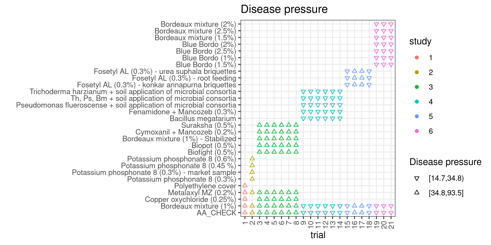
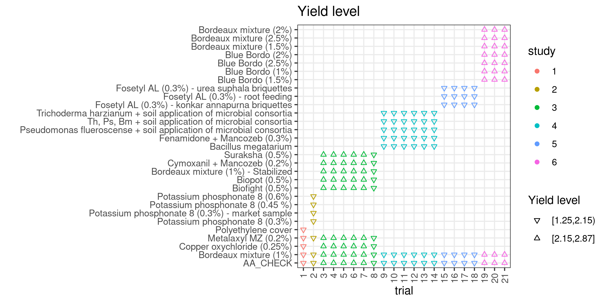

```{r echo=FALSE}
knitr::opts_chunk$set(echo = T, warning = F, message = F)
```

```{r}
pacman::p_load(tidyverse, janitor)
```

Load raw dataset

```{r}
raw <- readr::read_csv(here::here("data/data.csv"))
```

```{r}
raw %>% #names()

  # Sampling variance for log of the mean (Paul et al., 2008) to use in multivariate model
  # sampling variance for multivariate MA of disease incidence
  mutate(log_inc = log(inc)) %>% 
  mutate(vi = v_inc / (rep * inc^2)) %>% 
  
  # sampling variance for multivariate MA of relative yield
  mutate(log_yield = log(yield), 
         log_var_yield  = v_yield / (rep * yield^2)) %>%

  # sampling variance for multivariate MA of absolute yield
  mutate(var_yield = v_yield/rep) %>% 
  
  select(-(dose_1:agri_system)) %>% 
  group_by(trial) %>% 
  mutate(inc_check = inc[treatment == "AA_CHECK"]) %>%  
  mutate(yield_ref = yield[treatment == "Bordeaux mixture (1%)"]) %>% 
  mutate_if(is.character, as.factor) %>% 
  mutate_at(vars(variety), str_to_upper) %>% 
  mutate_at(vars(trial), as.factor) %>% 
  ungroup() %>% 
  
  # create disease pressure classes upon Check incidence
  mutate(inc_check_class = Hmisc::cut2(inc_check,  g=2)) %>% 
  
  # create yield level classes upon yield at Bordeaux mixture (1%)
  mutate(yield_class = Hmisc::cut2(yield_ref, g=2)) -> dat
```

```{r}
dat %>% 
  tabyl(treatment, trial)
```

# Disease pressure (based on check disease incidence)

```{r}
dat %>% 
  distinct(trial, .keep_all =TRUE) %>% 
  count(inc_check_class)
```

```{r eval=FALSE}
dat %>% 
  ggplot()+
  aes(x=treatment, y =trial, col =factor(study))+
  geom_point(aes(shape=inc_check_class))+
  scale_shape_manual(values=c(25, 24))+
  theme_bw()+
  coord_flip()+
  theme(axis.text.x=element_text(angle=90, hjust=1, vjust=.5))+
  labs(x="", col="study", shape = "Disease pressure", 
       title = "Disease pressure")

ggsave(last_plot(), file = "plots/dis_press.png", w=8, h=4)
```

{width=100%}

Set 1: trials 9-21 (-16,-17)  and treatments repeated >=3 [low disease pressure]

```{r}
dat %>% 
  filter(trial %in% c(9:15, 18:21)) %>% 
  filter(treatment %in%
           (count(., treatment, sort=T) %>%
           filter(n>2) %>% pull(treatment))
         ) %>%
  droplevels -> dat1
```


Set 2: trials 1-8, and treatments repeated >=3 [high disease pressure] 

```{r}
dat %>% 
  filter(trial %in% 1:8) %>% 
  filter(treatment %in% 
           (count(., treatment, sort=T) %>%
           filter(n>2) %>% pull(treatment)) 
         ) %>% 
  droplevels -> dat2  
```


# Yield level (based on treatment BM1%)

Trials per yield class

```{r}
dat %>% 
  distinct(trial, .keep_all =TRUE) %>% 
  count(yield_class)
```

```{r eval=FALSE}
dat %>% 
  ggplot()+
  aes(x=treatment, y =trial, col =factor(study))+
  geom_point(aes(shape=yield_class))+
  scale_shape_manual(values=c(25, 24))+
  theme_bw()+
  coord_flip()+
  theme(axis.text.x=element_text(angle=90, hjust=1, vjust=.5))+
  labs(x="", col="study", shape = "Yield level", 
              title = "Yield level")

ggsave(last_plot(), file = "plots/yld_level.png",w=8, h=4)

```

{width=100%}

Set 3: trials 9-18 [low yield level] 

```{r}
dat %>% 
  filter(trial %in% 9:18) %>% 
  filter(treatment %in% 
           (count(., treatment, sort=T) %>%
            filter(n>2) %>% pull(treatment)
            )) %>% 
  droplevels -> dat3  
```

Set 4: trials 3-7 + 19-21 [high yield level] 

```{r}
dat %>% 
  filter(trial %in% c(3:7, 19:21)) %>% 
  filter(treatment %in%
           (count(., treatment, sort=T) %>%
           filter(n>2) %>% pull(treatment))
         ) %>%
  droplevels -> dat4
```

Set BM: all trials, treatments BM1% and check

```{r}
raw %>% 
  count(treatment) %>% 
  filter(n>20) %>% 
  pull(treatment) -> bord

dat %>% 
  filter(treatment %in% bord) %>% 
  droplevels()-> dat_bord 
```


```{r}
# Save the tidy data for further analysis

save(raw, dat, dat1, dat2, dat3, dat4, dat_bord, file="data/data.RData")
```
